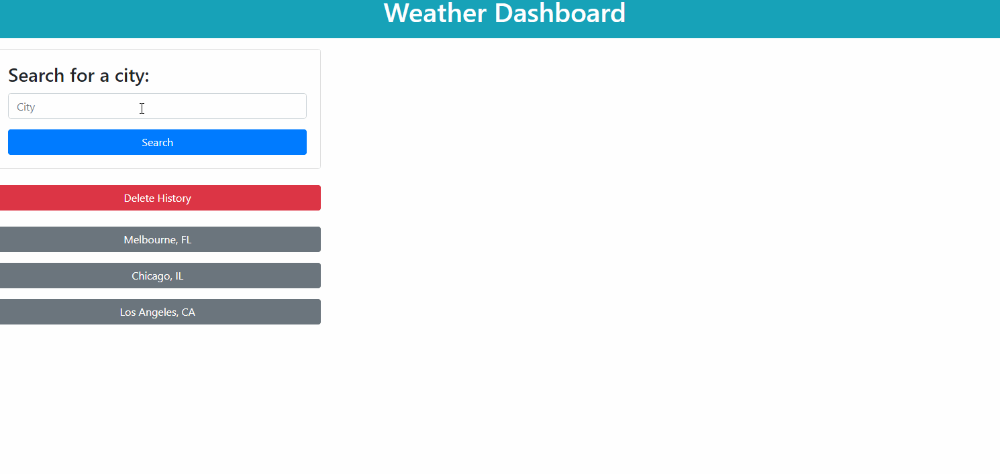

# Weather Dashboard

[Click here to visit the page!](https://lemonpocky.github.io/weather-dashboard/)

---

## About

Quickly search for weather from any location using the OpenWeather One Call API.

---

## Usage

Use the search bar to look up a city's weather information. When a search is completed, it is saved to the user's search history. Click on a button in the search history to look up that city's weather again. Clear search history using the "Delete History" button.

